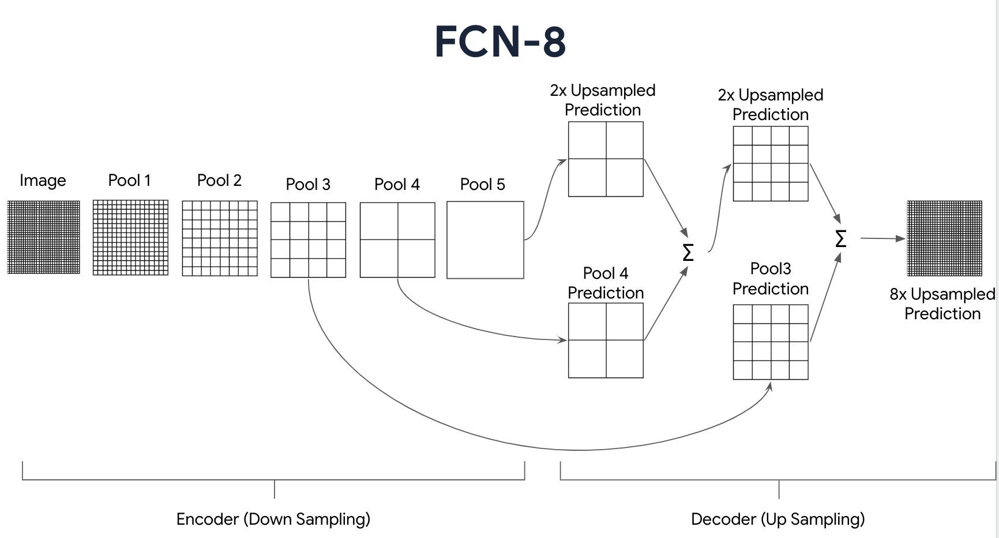
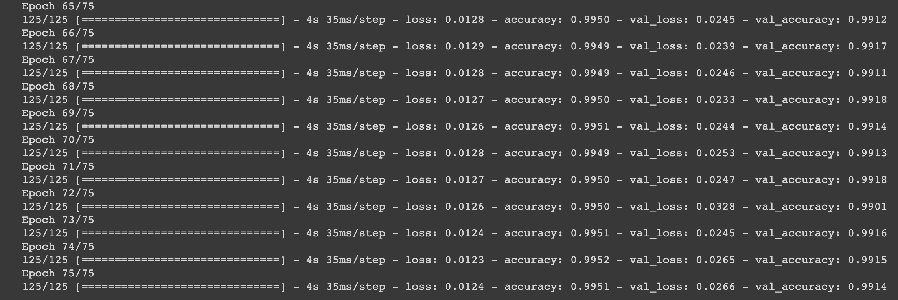
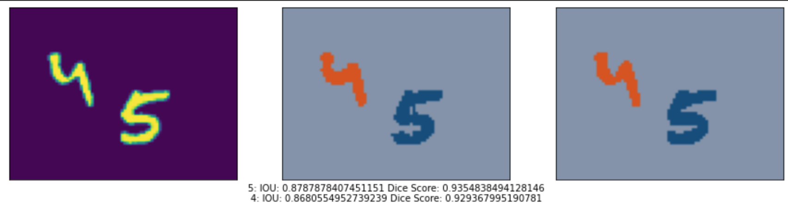
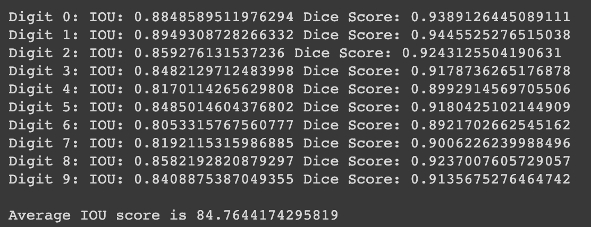

# Table of Contents

1.  [Overview](#orge5cdfe6)
2.  [Dataset](#org1508211)
    1.  [Preprocessing](#org6204ea1)
3.  [Model architecture](#org458e17b)
    1.  [Encoder](#orgfeaab07)
    2.  [Decoder](#org0b17ffc)
4.  [Model evaluation](#orgfb68214)
5.  [Results](#org5b4ef50)

# Overview

In the domain of computer vision, **image segmentation** is the process of partitioning a digital image into various *segments* or sets of pixels to make an image easier to analyze and process. This technique is particularly useful for determining object boundaries in a given image.
  
This technique assigns a **label** to each pixel and groups them together if they share same characteristic properties.  
In this project I use the `TensorFlow` backend for performing the task. I have also used the **M2NIST** dataset, which can is available on [Kaggle](https://www.kaggle.com/farhanhubble/multimnistm2nist).

# Dataset

The **M2NIST** dataset is a popular choice for *multidigit semantic segmentation*. Since it is available in the form of `NumPy (.npy)` array files, preprocessing is done relatively easily. There are 2 image files in the dataset:

-   `combined.npy` which contains the images with multiple **MNIST** datasets
-   `segmented.npy` contains the segmentation masks corresponding to the combined file

This dataset has **5000** images, each of them having dimensions `(64x84)`. A random split of the data is performed using the corresponding `TensorFlow` API.

## Preprocessing

The data is processed in **batches** with each one containing **32** images. Each of the images in our dataset is cast into the datatype `float32` whilst normalizing the pixel values across the RGB channels of the image.
  
Next, our data is split into the training and validation sets in an aribtrary split ratio that I chose to be `80:20` (for both the images and the corresponding annotations).

# Model architecture

The heart of my implementation lies in the model architecture that I have used. I chose to use the **FCN-8** (Fully convolutional Network) architecture for this purpose. It remains a somewhat elementary and popular choice for problems concerning *semantic segmentation* of images.
  
The following diagram summarizes the basic picture of the entire model:

## Encoder

I have used **2** `Conv2D` layers, each of which is followed by an activation using the `LeakyReLU` function. These layers are then **max pooled** followed by **normalization**. Diagramatically, the structure of the layers looks like so:
  
`Input -> Conv2D -> LeakyReLU -> Conv2d -> LeakyReLU -> MaxPooling2D -> Batch normalization`

This summarizes the building block of our encoder.

## Decoder

The decoder ties together **5 convolutional building blocks** which are used for *feature extraction* (apart from the fully connected layers).
  
An optimization (albeit *minor*) is introduced, where I have *resized* the image to have a dimension as a **power of 2**. For this purpose, I have used the builtin API of TensorFlow: `ZeroPadding2D`, which adds the necessary padding along the required dimensions to achieve my goal. Note that this must be done **only** along the width of the image, and not the height.

# Model evaluation

I have used 2 popular metrics for evaluating the accuracy of my model:

-   Dice score
-   Intersection Over Union (IOU)

The name **IOU** is more or less self-explanatory, where we compute the ratio of the **area of overlap** to **area of the union** between the ground truth and predicted label maps.
  
The **dice score** is somewhat similar to the **IOU** metric, with a minor difference where we introduce a **combined area** instead of the union area. A small *smoothing factor* is introduced to the combined area term to avoid a **division by 0** error.

# Results

I trained this model for a total of **75** epochs, which achieved a decent accuracy of **99.51%**.

\#+NAME fig: img-2

Segmentation of an arbitrary digit set:

\#+NAME fig: img-3

Average IOU and dice score on the validation set:

\#+NAME fig: img-4

